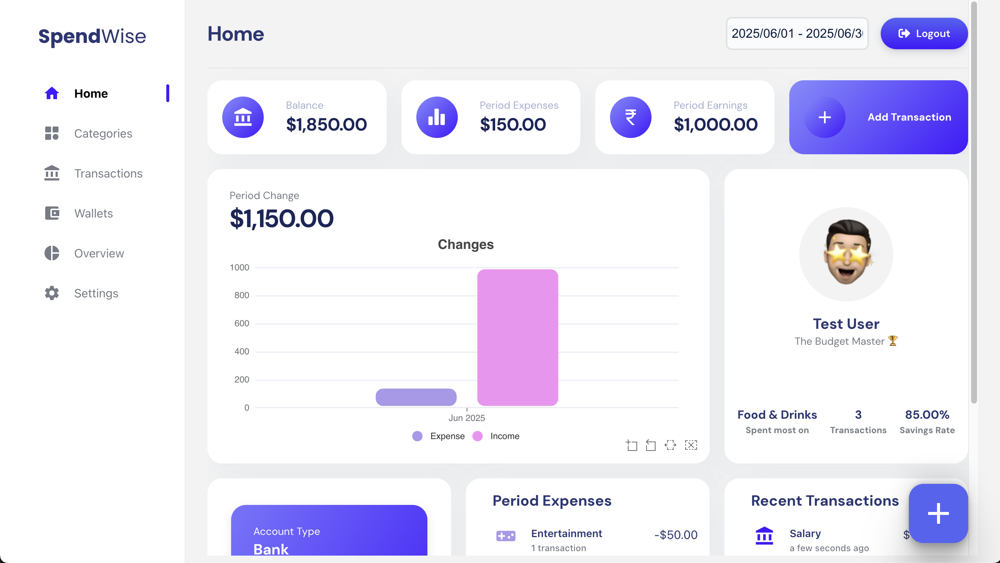
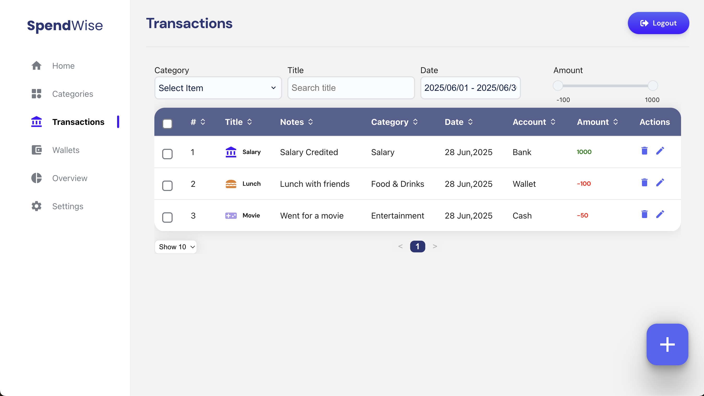
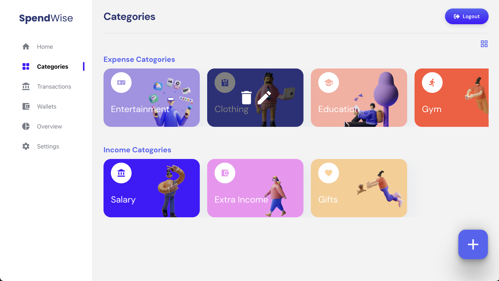
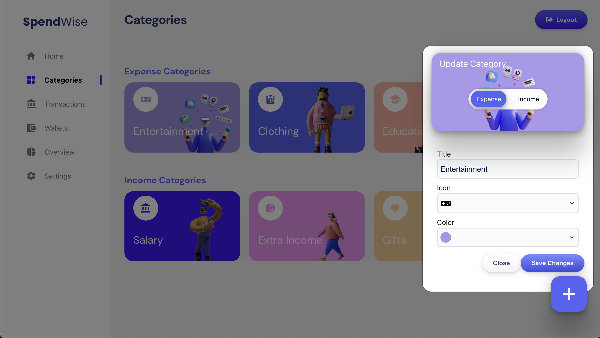
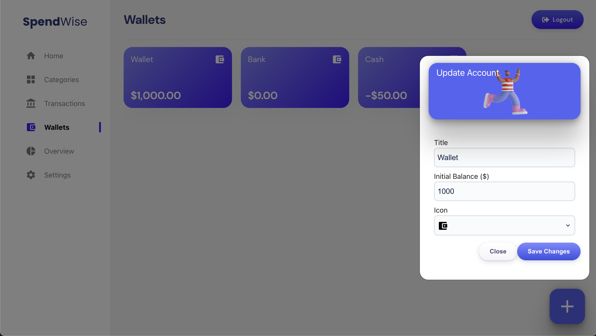
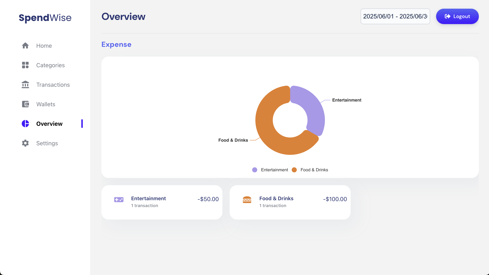
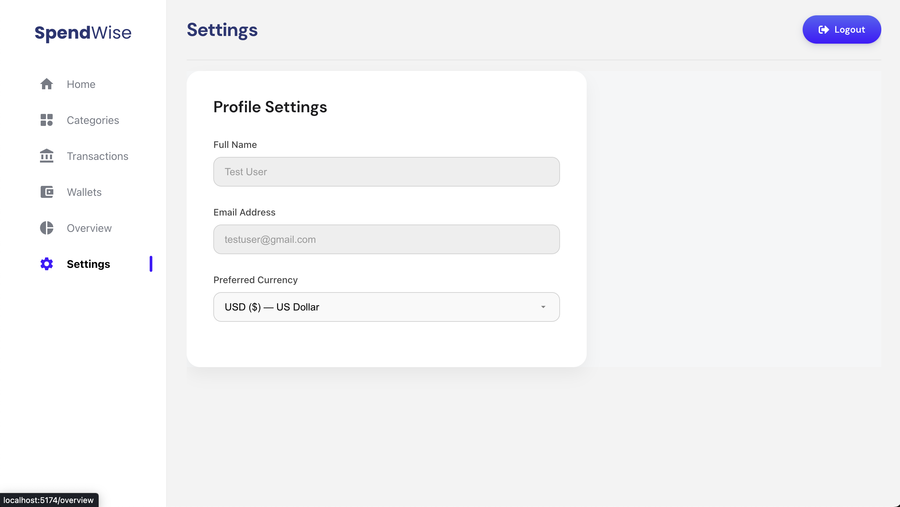

# SpendWise - Expense Tracker



SpendWise is a full-stack expense tracker application built using the MERN stack (MongoDB, Express.js, React, Node.js). The frontend is powered by React (Vite) and the backend by Node.js/Express with MongoDB. It uses Redux for state management and helps users manage their finances, track expenses, and visualize spending patterns with modern charts and analytics.

## Features
- JWT-Based Authentication with secure access and refresh token handling
- User authentication and secure session management
- RESTful API with secure session management
- State management with Redux Toolkit and React-Redux
- Add, edit, and delete expenses and income
- Categorize transactions
- Add and manage different financial accounts
- Dashboard with charts and analytics
- Responsive and modern UI

## Technologies Used
- **Frontend:**
  - React + Vite
  - Redux Toolkit & React-Redux
  - TypeScript
  - Highcharts (for data visualization)
  - Axios
  - React Router DOM
  - React Bootstrap, Bootstrap, Sass (SCSS)
  - Framer Motion
  - React Toastify (notifications)
  - Moment.js (date handling)
  - Other UI/utility libraries: classnames, react-icons, react-datepicker, react-loading-skeleton, swiper, currency.js etc.
  
- **Backend:**
  - Node.js
  - Express.js
  - MongoDB & Mongoose
  - JWT Authentication (jsonwebtoken)
  - bcryptjs (password hashing)
  - express-async-handler

## Prerequisites
Before running the application, make sure you have the following installed:

- [Node.js](https://nodejs.org/)
- [MongoDB](https://www.mongodb.com/) (local instance) or a [MongoDB Atlas](https://www.mongodb.com/cloud/atlas) account

---

## Getting Started

### 1. Clone the Repository
```bash
git clone https://github.com/athulrajhere/SpendWise-ExpenseTracker-React-Redux.git
cd SpendWise-ExpenseTracker-React-Redux
```

### 2. Setup the Backend
```bash
cd backend
npm install
```

#### Create a `.env` file in the `backend` directory with the following variables:
```env
MONGO_URL=your_mongodb_connection_string
PORT=3000
CORS_ORIGIN=http://localhost:5173
JWT_SECRET=your_jwt_secret
REFRESH_SECRET=your_refresh_secret
```
- Replace `your_mongodb_connection_string` with your MongoDB URI (local or Atlas).
- Set secure values for `JWT_SECRET` and `REFRESH_SECRET`.
- Adjust `CORS_ORIGIN` if your frontend runs on a different port or domain.

#### Start the Backend Server
```bash
npm run dev
```
The backend will run on [http://localhost:3000](http://localhost:3000) by default.

---

### 3. Setup the Frontend
```bash
cd ../spend-wise
npm install
```

#### Start the Frontend Development Server
```bash
npm run dev
```
The frontend will run on [http://localhost:5173](http://localhost:5173) by default.

---

## Environment Variables & Security
- **.env files are gitignored** for both backend and frontend. You must create your own `.env` files as described above.

## MongoDB Setup
- You can use a local MongoDB instance or [MongoDB Atlas](https://www.mongodb.com/cloud/atlas) for a cloud database.
- Make sure your MongoDB URI is accessible from your backend server.

## Project Structure
```
SpendWise-ExpenseTracker-React-Redux/
├── backend/         # Express/MongoDB backend
├── spend-wise/      # React (Vite) frontend
```

## Scripts
- **Backend**
  - `npm run dev` - Start backend with nodemon (auto-restart on changes)
  - `npm start` - Start backend normally
- **Frontend**
  - `npm run dev` - Start frontend in development mode
  - `npm run build` - Build frontend for production

## Screenshots

| Feature | Screenshot |
|---------|------------|
| Login |  |
| Dashboard |  |
| Transactions |  |
| Categories |  |
| Edt Category |  |
| Account |  |
| Overview  |  |
| Settings  |  |

## Contributing
Pull requests are welcome! For major changes, please open an issue first to discuss what you would like to change.

## License
[MIT](LICENSE)
